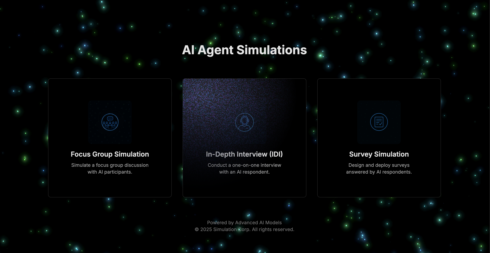

# AI Agent Simulations Platform



A platform for simulating AI agent interactions and behaviors, and to mimic some of the work done by market research firms and/or policy institues (for example: surveys and focus groups).

## Installation and Setup Guide

### Prerequisites

- Python 3.12 or later
- Node.js (v20.x recommended, v18+ should work)
- npm (v9.x or later)
- Git
- nvm (recommended for Node.js version management)

### Step 1: Clone the Repository

```bash
git clone https://github.com/OSH212/Virtual-Think-Thank.git
cd Virtual-Think-Thank
```

### Step 2: Python Backend Setup

1. Create and activate a Python virtual environment in the root directory:
   ```bash
   python3.12 -m venv myenv
   source myenv/bin/activate  # On Windows: myenv\Scripts\activate
   ```

2. Install Python dependencies from the root directory:
   ```bash
   pip install -r requirements.txt
   ```

3. Set up environment variables:
   - Create a `.env` file in the **root directory** based on the provided `.env_example`.
   - Add your necessary API keys and configurations as specified in `.env_example`. For example:
     ```
     OPENAI_API_KEY=your_openai_api_key
     ```

### Step 3: Next.js UI Setup

1. Navigate to the UI directory:
   ```bash
   cd openai-simulations-ui
   ```

2. Install Node.js (using nvm is recommended):
   ```bash
   nvm install 20  # Any recent LTS version (v18+) should work fine
   nvm use 20
   # Expected output (version numbers may vary slightly):
   # Now using node v20.x.x (npm v10.x.x)
   ```

3. Install dependencies:
   ```bash
   npm install @radix-ui/react-icons  # Ensure icons are installed first
   npm install
   ```

4. Start the development server:
   ```bash
   npm run dev
   # Expected output:
   # > openai-simulations-ui@0.1.0 dev
   # > next dev
   #
   #    ▲ Next.js 15.x.x 
   #    - Local:        http://localhost:3000
   #    - Network:      http://<your-local-ip>:3000 
   ```

5. Open [http://localhost:3000](http://localhost:3000) in your browser, select your preferred simulation, enter the parameters, and start the simulation.

## Running Python Simulations (non UI):

After setup, ensure your Python virtual environment is activated and you are in the root directory. You can run the simulation scripts directly from the command line, providing the necessary arguments.

**Important:** Each simulation run requires a unique `--simulation_id`. This ID is used to create a specific output directory for the results (reports, transcripts, visualizations) within the `openai-simulations-ui/public/simulations/<simulation_type>/` folder.

```bash
# Activate virtual environment if not already active
source myenv/bin/activate
```

### 1. Running the Survey Simulation

**Arguments:**
*   `--topic "Your Survey Topic"`: (Required) The main subject of the survey.
*   `--objectives "Your Research Objectives"`: (Required) What you aim to learn from the survey.
*   `--audience "Description of Target Audience"`: (Required) Who the survey is intended for.
*   `--respondents <number>`: (Optional, default: 50) How many virtual respondents to simulate.
*   `--simulation_id <unique_run_id>`: (Required) A unique identifier for this specific simulation run (e.g., `survey_run_001`).

**Example:**
```bash
python survey_simulation/survey_simulation.py \
  --topic "Electric Vehicle Adoption Trends" \
  --objectives "Understand consumer attitudes and purchase intentions towards EVs" \
  --audience "Urban car owners aged 30-55" \
  --respondents 100 \
  --simulation_id 12345
```

### 2. Running the IDI (In-Depth Interview) Simulation

**Arguments:**
*   `--topic "Interview Topic"`: (Optional, default: Mobile banking app user experience) The subject of the interview.
*   `--target_audience "Description of Audience"`: (Optional, default: Urban professionals aged 25-40) The profile type for the virtual respondent.
*   `--num_questions <number>`: (Optional, default: 8) The approximate number of questions the interviewer will aim to ask.
*   `--simulation_id <unique_run_id>`: (Required) A unique identifier for this specific interview simulation (e.g., `idi_mobile_banking_01`).

**Example:**
```bash
python idi_simulation/idi_simulation.py \
  --topic "Remote Work Tool Preferences" \
  --target_audience "Software developers working remotely for 1+ year" \
  --num_questions 10 \
  --simulation_id 123456
```

### 3. Running the Focus Group Simulation

**Arguments:**
*   `--topic "Focus Group Topic"`: (Optional, default: Consumer preferences for sustainable footwear) The main discussion topic.
*   `--target_audience "Description of Audience"`: (Optional, default: Urban professionals aged 25-40 interested in sustainability) The profile type for the virtual participants.
*   `--num_participants <number>`: (Optional, default: 4) How many virtual participants in the group.
*   `--num_rounds <number>`: (Optional, default: 3) How many rounds of discussion.
*   `--simulation_id <unique_run_id>`: (Required) A unique identifier for this specific focus group simulation (e.g., `focus_group_sustain_shoes_03`).

**Example:**
```bash
python focus_group_simulation/focus_group_simulation.py \
  --topic "Experiences with Online Grocery Shopping" \
  --target_audience "Busy parents aged 30-45 who order groceries online weekly" \
  --num_participants 6 \
  --num_rounds 4 \
  --simulation_id 1234567
```

## Troubleshooting Common Issues

### UI Components Not Loading
- Make sure all dependencies are installed correctly with `npm install`
- If needed, clear your browser cache and node_modules folder:
  ```bash
  rm -rf node_modules
  rm -rf .next
  npm install
  npm install @radix-ui/react-icons
  ```


## Tech Stack

- Backend: Python 3.12, OpenAI API
- Frontend: Next.js, React, Tailwind CSS
- Styling: Tailwind CSS, shadcn components


## Support

If you encounter any issues, please open an issue on the GitHub repository.

## License 

Copyright [2025] [(https://github.com/OSH212)]

Permission is hereby granted to view and read the contents of this repository for personal or evaluative purposes only.

You MAY NOT:
- Reproduce, redistribute, or modify any part of the code for public or private use.
- Use the code or its derivatives for commercial purposes.
- Clone, fork, or download the repository for reuse or redistribution without explicit written permission.
- Integrate this code into any project, product, or codebase, public or private, without explicit written permission.

All rights, title, and interest in and to the repository remain with the author.


